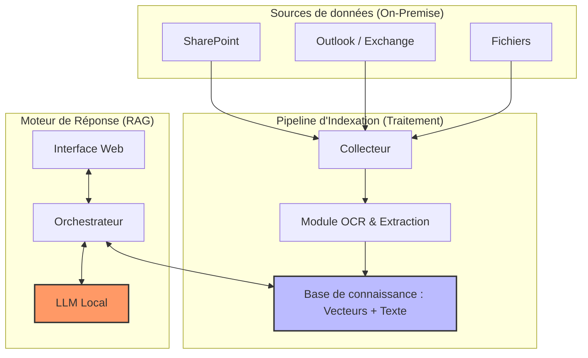

# Spécification du besoin - Assistant IA Search & RAG

## Le besoin

### 1. Objectifs du projet
L'objectif est de mettre en place un système de recherche intelligente (RAG - Retrieval Augmented Generation) pour **deux cas d'usage à échelles différentes** :

#### Cas d'usage 1 : Usage Interne Entreprise
- **Objectif** : Optimiser la recherche documentaire et la transmission de connaissances pour les collaborateurs.
- **Échelle** : ~50 utilisateurs simultanés
- **Volumétrie** : 300 000+ fichiers (SharePoint, Outlook, partages de fichiers)
- **Déploiement** : Serveur centralisé on-premise

#### Cas d'usage 2 : Usage Machine Industrielle (SAV)
- **Objectif** : Rendre les clients autonomes pour le dépannage de premier niveau et la prise en main des équipements.
- **Échelle** : 1 utilisateur à la fois (technicien sur site)
- **Volumétrie** : Quelques dizaines de documents (manuels machine, procédures spécifiques)
- **Déploiement** : PC industriel embarqué autonome

> **Exigence clé** : Une solution unique capable de **scaler** entre ces deux cas d'usage, du déploiement minimal (machine autonome) au déploiement centralisé (entreprise).

---

### 2. Architecture fonctionnelle (Gros grains)



> Les données issues de SharePoint, Outlook et des partages de fichiers sont traitées par un collecteur qui utilise un module OCR pour extraire le texte des documents. Ces données sont ensuite indexées dans une base de connaissance hybride (texte + vecteurs). L'interface web permet aux utilisateurs de poser des questions, qui sont traitées par un orchestrateur interagissant à la fois avec la base de connaissance et un LLM local pour générer des réponses précises et contextualisées.
>
> Pour garantir la confidentialité, toutes les données et traitements sont hébergés en interne (On-Premise), sans recours à des services cloud externes.

## 3. Périmètre détaillé par cas d'usage

### Cas 1 : Entreprise (Scale large)

| Aspect | Détail |
|--------|--------|
| **Utilisateurs** | ~50 collaborateurs (BE, RH, Commerce, Direction, Atelier) |
| **Concurrence** | 5-10 utilisateurs simultanés |
| **Documents** | 300 000+ fichiers (PDF, DOCX, XLSX, images, PPT) |
| **Sources** | SharePoint on-premise, Outlook/Exchange, partages de fichiers |
| **Mise à jour** | Indexation incrémentale quotidienne |
| **Authentification** | Active Directory / SSO |
| **Permissions** | Gestion des droits d'accès par utilisateur/groupe |

### Cas 2 : Machine Industrielle (Scale minimal)

| Aspect | Détail |
|--------|--------|
| **Utilisateurs** | 1 technicien à la fois (client final) |
| **Concurrence** | 1 utilisateur |
| **Documents** | ~30-100 fichiers (manuels machine, schémas, procédures) |
| **Sources** | Dossier local embarqué sur PC industriel |
| **Mise à jour** | Mise à jour manuelle lors de maintenance (trimestrielle/annuelle) |
| **Authentification** | Simple ou aucune (accès physique à la machine) |
| **Permissions** | Non nécessaire (tous les docs accessibles) |

### Exigence de scalabilité

La solution doit permettre :
- **Déploiement minimal** : Configuration légère pour un PC industriel (quelques dizaines de docs)
- **Déploiement centralisé** : Architecture robuste multi-utilisateurs pour l'entreprise (300k+ docs)
- **Même interface utilisateur** : Expérience cohérente entre les deux cas
- **Même stack technique** : Éviter de maintenir deux solutions différentes

---

### 4. Données et Intégrations
- **Types de documents** : 
    - Textes : PDF, DOC/DOCX, TXT.
    - Tableaux : CSV, XLSX, XLS.
    - Images : JPEG, JPG, PNG (requiert OCR).
    - Présentations : PPT, PPTX.
- **Volumétrie** : + 300 000 fichiers.
- **Sources** : SharePoint, mails (Outlook), partages de fichiers.
- **Mises à jour** : Indexation incrémentale quotidienne pour suivre les changements fréquents.

---

### 5. Fonctionnalités attendues
- **Recherche Full-text** : Recherche sémantique et par mots-clés dans l'intégralité du contenu des documents.
- **Génération de réponses** : Capacité à rédiger des réponses directes, des synthèses ou des guides de dépannage étape par étape.
- **Traçabilité** : Chaque réponse doit obligatoirement citer ses sources avec des liens directs vers les fichiers originaux.
- **Langues** : Interface et indexation principalement en Français, support de l'Anglais.

---

### 6. Contraintes Techniques et Sécurité
- **Déploiement On-Premise obligatoire** : Aucune donnée ne doit transiter par un cloud public pour garantir la confidentialité technique.
- **Sécurité** : Accès restreint au réseau interne de l'entreprise. Gestion des droits d'accès basée sur l'infrastructure existante.
- **Interfaces** : Interface Web (Barre de recherche et Chatbot).

--

## Solutions du marché : Solutions d'entreprise

> Voir le document `Comparaison.xlsx` pour une analyse détaillée des solutions du marché.

---

## Solutions Open Source RAG

### 1. Danswer

**Description**  
Danswer est une plateforme open source de recherche et de chat d'entreprise basée sur le RAG. Elle propose une interface utilisateur complète avec gestion des connecteurs, des permissions et un chat intégré.

**Couverture du besoin**

| Besoin | Couverture | Détail |
|--------|------------|--------|
| Types de documents | Complète | PDF, DOCX, TXT, XLSX, PPTX via parsing natif + OCR optionnel |
| Sources de données | Bonne | Connecteurs SharePoint Online, Google Drive, Confluence, Slack, fichiers locaux |
| Recherche hybride | Complète | Recherche sémantique (vecteurs) + full-text (mots-clés) |
| Génération de réponses | Complète | Chat avec citations, synthèses, réponses détaillées |
| Traçabilité / Sources | Complète | Chaque réponse cite les documents sources avec liens |
| Multi-utilisateurs | Complète | Authentification, gestion des groupes et permissions |
| On-Premise | Complète | Déploiement Docker auto-hébergé |
| LLM Local | Complète | Support Ollama, llama.cpp, ou API compatible OpenAI |
| Langues FR/EN | Bonne | Dépend du modèle LLM choisi (Mistral, Llama recommandés) |
| Scalabilité | Moyenne | Architecture lourde (5+ services Docker) ; difficilement adaptable pour déploiement minimal |

**Limites**

- **SharePoint On-Premise** : Le connecteur natif cible SharePoint Online (Microsoft 365). Pour SharePoint on-prem, un développement custom ou un connecteur tiers est nécessaire.
- **OCR avancé** : L'OCR n'est pas natif pour les images ; nécessite une intégration avec Tesseract ou Unstructured.io.
- **Volumétrie 300k fichiers** : Nécessite une infrastructure robuste (RAM, stockage SSD) et une optimisation des pipelines d'indexation.

**Mise en place**

```bash
# Cloner le dépôt
git clone https://github.com/danswer-ai/danswer.git
cd danswer/deployment/docker_compose

# Configurer les variables d'environnement
cp .env.example .env
# Éditer .env : configurer le LLM (Ollama), les connecteurs, l'authentification

# Lancer les services
docker-compose -f docker-compose.dev.yml up -d
```

**Prérequis infrastructure** :
- Docker + Docker Compose
- 16 Go RAM minimum (32 Go recommandé pour 300k docs)
- GPU optionnel pour accélérer l'inférence LLM
- Stockage SSD pour la base vectorielle

---

### 2. PrivateGPT

**Description**  
PrivateGPT est une solution RAG 100% locale, conçue pour garantir la confidentialité totale des données. Aucune donnée ne quitte le serveur. Il s'appuie sur des LLM locaux (Ollama, llama.cpp) et une base vectorielle embarquée.

**Couverture du besoin**

| Besoin | Couverture | Détail |
|--------|------------|--------|
| Types de documents | Complète | PDF, DOCX, TXT, CSV, PPTX, images (via OCR intégré) |
| Sources de données | Partielle | Ingestion par dossier local uniquement ; pas de connecteurs SharePoint/Outlook natifs |
| Recherche hybride | Complète | Recherche sémantique + full-text |
| Génération de réponses | Complète | Chat, résumés, Q&A avec contexte |
| Traçabilité / Sources | Complète | Citations des chunks sources dans chaque réponse |
| Multi-utilisateurs | Limitée | Mono-utilisateur par défaut ; pas de gestion de permissions |
| On-Premise | Complète | 100% local, zéro appel externe |
| LLM Local | Complète | Ollama, llama.cpp, GPT4All intégrés |
| Langues FR/EN | Bonne | Selon le modèle (Mistral 7B excellent en FR) |
| Scalabilité | Limitée | Excellent pour déploiement minimal ; moins adapté pour gros volumes et multi-utilisateurs |
**Limites**

- **Pas de connecteurs natifs** : Nécessite de synchroniser manuellement les fichiers depuis SharePoint/Outlook vers un dossier local (script custom ou outil tiers comme rclone).
- **Mono-utilisateur** : Pas de gestion des droits d'accès ; tous les utilisateurs voient tous les documents.
- **Interface basique** : UI fonctionnelle mais moins aboutie que Danswer.
- **Scalabilité** : Moins optimisé pour les très gros volumes sans tuning.

**Mise en place**

```bash
# Cloner le dépôt
git clone https://github.com/zylon-ai/private-gpt.git
cd private-gpt

# Installer les dépendances (Python 3.11+)
poetry install --extras "ui llms-ollama embeddings-ollama vector-stores-qdrant"

# Configurer le modèle local
ollama pull mistral

# Lancer l'application
make run
```

**Prérequis infrastructure** :
- Python 3.11+
- Ollama installé avec un modèle (Mistral, Llama 3)
- 16 Go RAM minimum
- GPU recommandé pour des réponses rapides

---

### 3. Quivr

**Description**  
Quivr se positionne comme un "second cerveau" open source. Il permet de créer des bases de connaissances personnelles ou partagées, avec une interface chat moderne et une API REST pour les intégrations.

**Couverture du besoin**

| Besoin | Couverture | Détail |
|--------|------------|--------|
| Types de documents | Bonne | PDF, DOCX, TXT, Markdown, CSV ; support images limité |
| Sources de données | Partielle | Upload manuel ou API ; connecteurs SharePoint/Outlook non natifs |
| Recherche hybride | Complète | Recherche vectorielle + métadonnées |
| Génération de réponses | Complète | Chat conversationnel, synthèses |
| Traçabilité / Sources | Complète | Sources citées avec chunks |
| Multi-utilisateurs | Complète | Gestion des utilisateurs, "brains" partagés ou privés |
| On-Premise | Complète | Déploiement Docker self-hosted |
| LLM Local | Bonne | Support Ollama, ou API compatible |
| Langues FR/EN | Bonne | Dépend du modèle LLM |
| Scalabilité | Moyenne | Architecture multi-services ; moins testé pour très gros volumes ; adapté pour scale moyen |

**Limites**

- **Connecteurs entreprise** : Pas de connecteurs natifs SharePoint/Outlook ; nécessite un développement ou une synchro manuelle.
- **OCR images** : Support limité pour les images ; nécessite une préparation externe.
- **Maturité** : Projet plus jeune, moins éprouvé sur des volumétries très importantes (300k+ fichiers).
- **Ressources** : L'architecture (Supabase, Redis, etc.) peut être lourde à maintenir on-premise.

**Mise en place**

```bash
# Cloner le dépôt
git clone https://github.com/QuivrHQ/quivr.git
cd quivr

# Copier et configurer l'environnement
cp .env.example .env
# Éditer .env : configurer Supabase, le LLM (Ollama), les clés

# Lancer avec Docker Compose
docker-compose -f docker-compose.yml up -d
```

**Prérequis infrastructure** :
- Docker + Docker Compose
- PostgreSQL (via Supabase self-hosted)
- Redis
- 16 Go RAM minimum
- GPU optionnel

---

### 4. Anything LLM

**Description**  
Anything LLM est une solution RAG tout-en-un ultra-légère, conçue pour être simple à déployer et facile à utiliser. Elle offre une interface moderne de type "drag & drop" pour l'ingestion de documents et supporte plusieurs LLM locaux.

**Couverture du besoin**

| Besoin | Couverture | Détail |
|--------|------------|--------|
| Types de documents | Complète | PDF, DOCX, TXT, CSV, PPTX, Markdown, images (via OCR) |
| Sources de données | Limitée | Upload manuel ou dossier local ; pas de connecteurs SharePoint/Outlook natifs |
| Recherche hybride | Complète | Recherche vectorielle + full-text |
| Génération de réponses | Complète | Chat conversationnel, citations des sources |
| Traçabilité / Sources | Complète | Sources citées avec extraits |
| Multi-utilisateurs | Bonne | Gestion des utilisateurs et "workspaces" isolés |
| On-Premise | Complète | Installation locale, Docker ou binaire standalone |
| LLM Local | Complète | Support Ollama, llama.cpp, LocalAI intégrés |
| Langues FR/EN | Bonne | Selon le modèle LLM choisi |
| Scalabilité | Limitée | Architecture légère scalable, **mais pas de système d'ingestion pour gros volumes** |

**Limites**

- **Pas de crawler/ingestion automatique** : Upload manuel uniquement (interface web ou API) ; pas d'indexation incrémentale ni de détection de changements.
- **Volumétrie limitée** : Conçu pour quelques centaines à quelques milliers de documents max, **pas testé/optimisé pour 300k+ fichiers**.
- **Connecteurs entreprise** : Pas de connecteurs natifs pour SharePoint/Outlook ; nécessite développement custom d'un pipeline d'ingestion externe.
- **Gestion des permissions granulaires** : Moins avancée que Danswer ; isolation par workspace mais pas de sync AD/LDAP natif.

**Mise en place**

```bash
# Option 1 : Installation binaire (le plus simple)
npx -y anything-llm
# Ouvrir http://localhost:3001

# Option 2 : Docker
docker pull mintplexlabs/anythingllm
docker run -d -p 3001:3001 \
  -v anythingllm-storage:/app/server/storage \
  mintplexlabs/anythingllm

# Option 3 : Installation complète
git clone https://github.com/Mintplex-Labs/anything-llm.git
cd anything-llm
yarn install
yarn dev:server
yarn dev:frontend
```

**Prérequis infrastructure** :
- **Minimal** : 4 Go RAM, 2 cœurs (pour quelques dizaines de docs)
- **Recommandé** : 8-16 Go RAM, 4+ cœurs (pour quelques milliers de docs)
- **Maximum testé** : ~10 000 documents (au-delà, performance non garantie)
- Node.js 18+ (si installation source)
- Ollama ou autre LLM local

---

## Estimation des besoins matériels

### Cas 1 : Entreprise (300k+ fichiers, 50 utilisateurs)

**Configuration Minimale Viable**
- **CPU** : 8 cœurs / 16 threads (Xeon ou Ryzen)
- **RAM** : 64 Go minimum (128 Go recommandé)
- **Stockage** : 1 To SSD NVMe (base vectorielle) + 4 To HDD (documents bruts)
- **GPU** : NVIDIA RTX 4090 (24 Go VRAM) ou équivalent datacenter (A100, H100)
- **Réseau** : 10 Gbps interne pour accès aux sources de données
- **Coût matériel estimé** : 8 000 € - 15 000 € (sans GPU datacenter)

### Cas 2 : Machine Industrielle (30-100 fichiers, 1 utilisateur)

**Configuration "Minimum Syndical"**
- **CPU** : 2-4 cœurs (Intel i3 ou Celeron décent)
- **RAM** : 4 Go (8 Go recommandé pour plus de confort)
- **Stockage** : 128 Go SSD
- **GPU** : Sans (Inférence CPU uniquement avec modèles 1B/3B quantifiés)
- **Coût matériel estimé** : 500 € - 1 200 €
