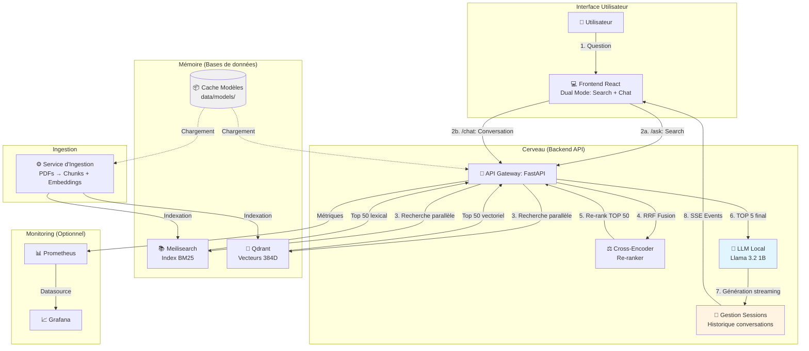
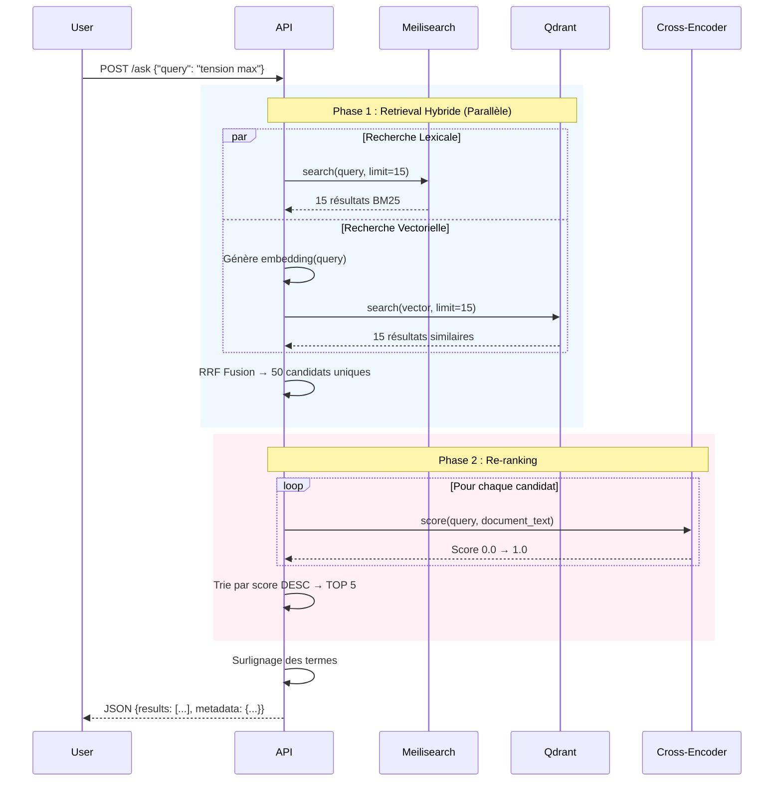
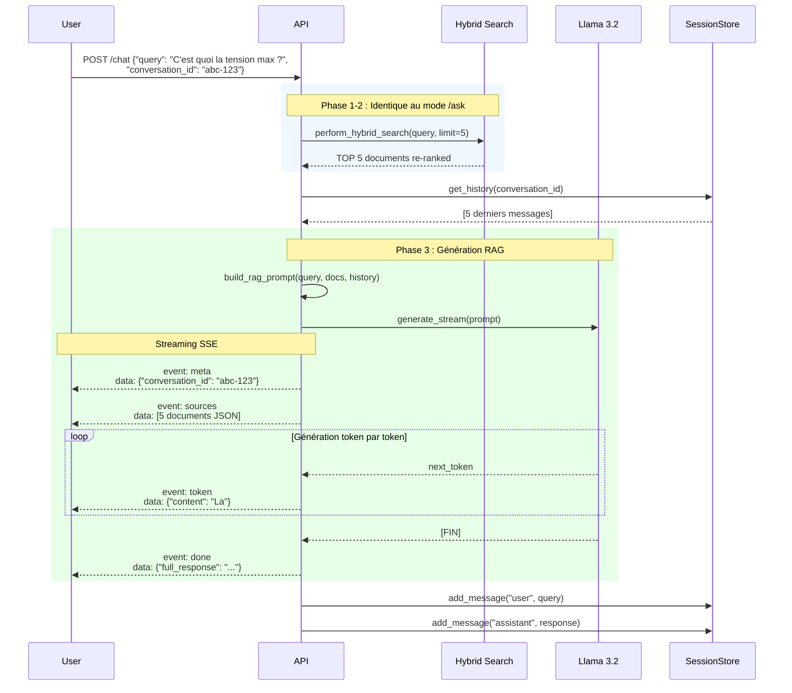

# Documentation Technique & Fonctionnelle : Système de Recherche Hybride RAG avec Chat IA

Cette documentation détaille le fonctionnement du moteur de recherche documentaire intelligent avec génération de réponses par IA. Elle est conçue pour être accessible aux néophytes tout en fournissant la précision technique nécessaire aux développeurs.

---

## 1. Introduction : L'Analogie de l'Équipe Documentaire

Pour comprendre ce système, imaginez une équipe de **quatre personnes** chargée de trouver et formuler une réponse dans une immense bibliothèque :

1.  **Le Documentaliste Rapide (Meilisearch / BM25) :** Il a un index de tous les mots. Si vous cherchez "Erreur 404", il vous donne instantanément toutes les pages contenant "Erreur" et "404". C'est rapide, mais il ne comprend pas le sens.
2.  **L'Assistant Sémantique (Qdrant / Vecteurs) :** Il a lu tous les livres et comprend les concepts. Si vous demandez "Pourquoi mon appareil ne marche pas ?", il trouvera les pages parlant de "panne", "défaut" ou "problème", même si le mot "marche" n'y est pas.
3.  **Le Juge Expert (Cross-Encoder / Re-ranker) :** Il est plus lent mais très méticuleux. Il prend les 50 documents trouvés par les deux premiers, les lit attentivement un par un en les comparant à votre question, et décide lesquels sont *vraiment* la meilleure réponse.
4.  **Le Rédacteur IA (LLM - Llama 3.2) :** Une fois les meilleurs documents identifiés, il les lit et rédige une réponse claire, structurée et en langage naturel, en citant ses sources. Il peut aussi converser en se souvenant du contexte précédent.

**Ce système fait exactement cela informatiquement :**
*   **Hybride :** Il combine Mots-clés + Sens.
*   **Reranking :** Il vérifie les résultats pour une précision maximale.
*   **Génération augmentée (RAG) :** Il utilise un LLM pour synthétiser une réponse naturelle basée sur les documents trouvés.
*   **Conversationnel :** Il maintient l'historique des échanges pour un dialogue contextuel.

---

## 2. Architecture Technique

Le système repose sur une architecture micro-services conteneurisée via Docker, composée de **8 services** :

### Services Applicatifs (4)
- **Frontend** : Interface React/TypeScript avec Tailwind CSS (port 5173)
- **API** : Gateway FastAPI gérant la recherche et le chat (port 8000)
- **Meilisearch** : Moteur de recherche lexicale BM25 (port 7700)
- **Qdrant** : Base de données vectorielle (port 6333)
- **Ingestor** : Service d'ingestion des PDFs (exécution ponctuelle)

### Stack de Monitoring (4 - optionnel)
- **Prometheus** : Collecte des métriques (port 9090)
- **Grafana** : Dashboards de visualisation (port 3000)
- **cAdvisor** : Métriques des conteneurs Docker (port 8080)
- **node-exporter** : Métriques système (port 9100)



---

## 3. Le Fonctionnement en Détail

### Étape 1 : L'Ingestion (La préparation des données)
Avant de pouvoir chercher, le système doit "lire" et "comprendre" les fichiers PDF.

1.  **Extraction :** Le texte est extrait du PDF.
2.  **Chunking (Découpage) :** Le texte est trop long pour être analysé d'un bloc. Il est découpé en morceaux ("chunks") d'environ 150 mots (800 caractères).
    *   *Subtilité technique :* On garde un "overlap" (chevauchement) de 200 caractères entre les morceaux pour ne pas couper une phrase importante au milieu.
3.  **Double Indexation :**
    *   Le texte brut part dans **Meilisearch** pour la recherche par mots-clés.
    *   Le texte est transformé en vecteurs (une liste de 384 nombres) par un modèle IA (`Bi-Encoder`) et stocké dans **Qdrant**.

### Étape 2 : La Recherche (Retrieval)
Quand l'utilisateur pose une question, le système lance deux recherches parallèles :

*   **Recherche Lexicale (BM25) :** Cherche les mots exacts.
    *   *Avantage :* Imbattable pour des références précises (ex: "Article L-123", "Erreur 500").
*   **Recherche Vectorielle (Dense Retrieval) :**
    *   La question est transformée en vecteur mathématique.
    *   On cherche dans Qdrant les vecteurs de documents les plus proches spatialement (Cosinus Similarity).
    *   *Avantage :* Trouve la réponse même si les mots sont différents (Synonymes, périphrases).

### Étape 3 : La Fusion (RRF - Reciprocal Rank Fusion)
L'API reçoit ~50 résultats de Meilisearch et ~50 de Qdrant. Comment les mélanger ?
Ils n'ont pas les mêmes scores (Meili donne des scores entiers, Qdrant des pourcentages).
On utilise le **RRF** qui se base uniquement sur le **classement** :
> "Si un document est 1er chez Meili et 3ème chez Qdrant, c'est probablement un excellent candidat."

### Étape 4 : Le Re-ranking (La vérification)
C'est ici que la magie opère pour obtenir une précision "Enterprise Grade".

Les ~50 meilleurs candidats issus de la fusion passent devant le **Cross-Encoder**.
*   **Bi-Encoder (Utilisé avant) :** Traite la question et le document séparément. Rapide mais manque de nuance.
*   **Cross-Encoder (Le Juge) :** Prend la paire `(Question + Document)` et l'analyse comme un tout. Il peut comprendre les liens logiques complexes.
    *   *Exemple :* Si la question est "Qu'est-ce qui n'est **pas** autorisé ?", le vecteur seul peut confondre avec "Ce qui est autorisé". Le Cross-Encoder verra la négation.

### Étape 5 : La Génération (Mode Chat uniquement)
**Deux modes de fonctionnement :**

#### Mode Recherche (`/ask`) - Réponse JSON instantanée
- Retourne directement les TOP 5 documents avec surlignage des termes
- Format JSON structuré avec métadonnées (titre, page, score, extrait)
- Rapide (~2-3 secondes)
- Utilisé pour une consultation rapide des sources

#### Mode Chat (`/chat`) - Conversation avec IA
Après avoir obtenu les TOP 5 documents, le système :

1.  **Construit un prompt RAG :**
    ```
    Système: Tu es un assistant documentaire...
    Historique: [5 derniers messages de la conversation]
    Documents pertinents: [Extraits des TOP 5]
    Question: [Question de l'utilisateur]
    ```

2.  **Génération streaming (SSE - Server-Sent Events) :**
    - Le LLM génère la réponse token par token
    - Chaque token est envoyé immédiatement au frontend (affichage en temps réel)
    - Événements émis :
        - `meta` : ID de conversation
        - `sources` : Liste des 5 documents utilisés
        - `token` : Chaque mot généré au fur et à mesure
        - `done` : Réponse complète finale

3.  **Gestion de session :**
    - Chaque conversation a un `conversation_id` unique
    - L'historique (user + assistant) est conservé en mémoire
    - Les 5 derniers échanges sont utilisés comme contexte
    - Permet des questions de suivi ("Et pour le modèle suivant ?")

4.  **Résilience :**
    - Si le LLM n'est pas disponible (pas de modèle configuré), retombe sur le mode recherche simple
    - Circuit breakers sur Meilisearch et Qdrant (5 échecs → OPEN → 60s timeout)

---

## 4. Les Modèles d'IA (Le Cerveau)

### 4.1 Modèles Hugging Face (Embeddings & Re-ranking)

| Rôle | Modèle Technique | Taille | Pourquoi ce choix ? |
|------|------------------|--------|---------------------|
| **Vectorisation<br/>(Bi-Encoder)** | `paraphrase-multilingual-MiniLM-L12-v2` | 384 dimensions<br/>~120 MB | Modèle **multilingue** optimisé. Le L12 (12 couches) est plus profond que le L6 standard et capte mieux les nuances du français. Génère les embeddings pour Qdrant. |
| **Re-ranking<br/>(Cross-Encoder)** | `cross-encoder/ms-marco-MiniLM-L-6-v2` | ~90 MB | Entraîné sur MS MARCO (Microsoft) pour le scoring de pertinence Question-Document. Analyse les paires en contexte (contrairement au Bi-Encoder qui encode séparément). |
| **LLM Local<br/>(Génération)** | `llama-3.2-1b-instruct-q8_0.gguf` | 1.3 GB<br/>(quantifié Q8) | Llama 3.2 de Meta, version 1B optimisée pour l'instruction-following. Format GGUF (llama.cpp) pour inférence CPU efficace. Supporte le français via entraînement multilingue. |

### 4.2 Stratégie de Cache des Modèles

**Problématique :** Les modèles Hugging Face sont volumineux (~1.5 GB au total). Les télécharger à chaque démarrage de conteneur serait :
- Lent (plusieurs minutes)
- Coûteux en bande passante
- Problématique sur Windows (permissions Docker volumes)

**Solution implémentée :**

1.  **Pré-téléchargement sur l'hôte :**
    ```bash
    python download_models.py
    ```
    - Télécharge tous les modèles dans `data/models/` (hôte)
    - Structure Hugging Face préservée (`models--<org>--<name>/snapshots/<hash>/`)

2.  **Montage Read-Only dans les conteneurs :**
    ```yaml
    volumes:
      - ./data/models:/app/models:ro  # API
      - ./data/models:/workdir/data/models:ro  # Ingestor
    environment:
      - HF_CACHE_DIR=/app/models  # Pointe vers le montage
    ```

3.  **Chargement avec `cache_folder` :**
    ```python
    cache_dir = os.getenv("HF_CACHE_DIR")
    embed_model = SentenceTransformer(EMBED_MODEL, cache_folder=cache_dir)
    cross_encoder = CrossEncoder(RERANK_MODEL, cache_folder=cache_dir)
    ```

**Avantages :**
- Démarrage instantané (pas de téléchargement)
- Économie de ~500 MB de RAM (pas de duplication en cache)
- Partagé entre API et Ingestor
- Aucun problème de permissions (read-only)

---

## 5. Flux de Données (Data Flow)

### 5.1 Mode Recherche (`POST /ask`)



### 5.2 Mode Chat (`POST /chat`)



### 5.3 Temps d'Exécution Typiques

| Étape | Mode Search | Mode Chat | Note |
|-------|-------------|-----------|------|
| Retrieval Hybride | 0.5 - 1.5s | 0.5 - 1.5s | Dépend du corpus |
| Re-ranking (50→5) | 1 - 2s | 1 - 2s | CPU-intensif |
| **Total Search** | **~2-3s** | - | Réponse immédiate |
| Génération LLM | - | 10 - 30s | Streaming progressif |
| **Total Chat** | - | **~12-32s** | Mais affichage temps réel |

## 6. Glossaire Technique

### Concepts Généraux
*   **RAG (Retrieval Augmented Generation) :** Technique d'IA combinant recherche documentaire (Retrieval) et génération de texte (Generation). Le LLM base ses réponses sur les documents trouvés plutôt que sur sa mémoire interne, réduisant les hallucinations.
*   **Chunk :** Fragment de texte issu du découpage d'un document long. Un PDF de 100 pages génère ~300-500 chunks de 800 caractères chacun.
*   **Embedding / Vecteur :** Représentation numérique d'un texte sous forme de liste de nombres (ex: 384 dimensions). Des textes similaires ont des vecteurs proches mathématiquement.
*   **Inférence :** Processus de calcul par lequel un modèle d'IA produit un résultat (vecteur, score, texte généré).

### Recherche
*   **BM25 (Best Matching 25) :** Algorithme de ranking pour la recherche lexicale, amélioration du TF-IDF. Scoring basé sur la fréquence des termes et la longueur du document.
*   **Dense Retrieval :** Recherche vectorielle par similarité cosinus. "Dense" car les embeddings utilisent toutes les dimensions (contrairement aux vecteurs creux TF-IDF).
*   **RRF (Reciprocal Rank Fusion) :** Algorithme de fusion de résultats provenant de plusieurs sources. Formule : `score = Σ 1/(k + rank_i)` où k=60 par défaut.
*   **Bi-Encoder :** Modèle qui encode query et documents séparément, puis calcule la similarité. Rapide mais moins précis.
*   **Cross-Encoder :** Modèle qui analyse la paire (query, document) conjointement. Plus lent mais plus précis. Utilisé pour le re-ranking final.

### LLM & Chat
*   **LLM (Large Language Model) :** Modèle d'IA entraîné sur des milliards de mots pour comprendre et générer du langage naturel (ex: Llama, GPT).
*   **GGUF (GPT-Generated Unified Format) :** Format de fichier optimisé pour les modèles LLM quantifiés, utilisé par llama.cpp.
*   **Quantification (Q8) :** Technique de compression réduisant la précision numérique (32 bits → 8 bits) pour diminuer la taille et accélérer l'inférence avec perte de qualité minime.
*   **SSE (Server-Sent Events) :** Protocole HTTP permettant au serveur d'envoyer des mises à jour en temps réel au client (alternative à WebSocket, unidirectionnel).
*   **Streaming :** Technique d'envoi de la réponse LLM token par token (mot par mot) au lieu d'attendre la génération complète. Améliore l'expérience utilisateur.
*   **Prompt Engineering :** Art de formuler les instructions au LLM pour obtenir les meilleurs résultats. Le prompt RAG inclut : rôle système, historique, documents, question.
*   **Température (LLM) :** Paramètre (0.0 → 2.0) contrôlant la créativité. 0.0 = déterministe/factuel, 2.0 = créatif/aléatoire. Configuré à 0.7 par défaut.
*   **Context Window (n_ctx) :** Nombre maximum de tokens que le LLM peut traiter simultanément. Llama 3.2 : 4096 tokens (configuré), capacité max 40960.

### Infrastructure
*   **Circuit Breaker :** Pattern de résilience. Si un service échoue N fois (5), passe en état OPEN (refuse les requêtes) pendant T secondes (60s), puis HALF_OPEN (teste 1 requête).
*   **Health Check :** Endpoint de monitoring (`/health/ready`) vérifiant que tous les composants fonctionnent avant d'accepter du trafic.
*   **Lazy Loading :** Chargement différé d'une ressource (ex: LLM) uniquement au premier usage, pour accélérer le démarrage.
*   **Read-Only Mount (`:ro`) :** Montage de volume Docker en lecture seule, empêchant toute modification depuis le conteneur.

---

## 7. API Endpoints

L'API FastAPI expose plusieurs endpoints pour la recherche, le chat et le monitoring.

### 7.1 Endpoints Principaux

#### `POST /ask` - Recherche Documentaire
Recherche hybride retournant les documents pertinents en JSON.

**Request:**
```json
{
  "query": "Quelle est la tension maximale ?",
  "limit": 5
}
```

**Response:**
```json
{
  "query": "Quelle est la tension maximale ?",
  "results": [
    {
      "content": "La tension maximale est de <mark>3.6V</mark>...",
      "title": "Datasheet_Produit",
      "page": 12,
      "score": 0.8734,
      "path": "/docs/datasheet.pdf",
      "chunk_id": "datasheet_12_3"
    }
  ],
  "total": 5,
  "search_mode": "hybrid",
  "processing_time_ms": 2341
}
```

#### `POST /chat` - Conversation avec IA
Génération de réponse contextualisée avec streaming SSE.

**Request:**
```json
{
  "query": "C'est quoi la tension max ?",
  "conversation_id": "uuid-optional",
  "limit": 5
}
```

**Response (SSE Stream):**
```
event: meta
data: {"conversation_id": "abc-123"}

event: sources
data: [{"title": "...", "page": 12, ...}]

event: token
data: {"content": "La"}

event: token
data: {"content": " tension"}

...

event: done
data: {"full_response": "La tension maximale est de 3.6V..."}
```

#### `POST /chat/new` - Nouvelle Conversation
Crée un nouvel ID de conversation.

**Response:**
```json
{
  "conversation_id": "f3b7e5d2-1a4c-4e9b-8c3d-2f6a1b9c4e7d"
}
```

#### `GET /chat/{conversation_id}` - Historique
Récupère l'historique complet d'une conversation.

**Response:**
```json
{
  "conversation_id": "abc-123",
  "messages": [
    {"role": "user", "content": "Quelle est la tension ?"},
    {"role": "assistant", "content": "La tension est..."}
  ],
  "created_at": "2026-02-10T13:00:00",
  "updated_at": "2026-02-10T13:05:23"
}
```

### 7.2 Endpoints de Monitoring

#### `GET /health/live` - Liveness Probe
Vérifie que l'API répond (pour Kubernetes/Docker health checks).

**Response:** `200 OK` ou `503 Service Unavailable`

#### `GET /health/ready` - Readiness Probe
Vérifie que tous les composants sont opérationnels.

**Response:**
```json
{
  "status": "ready",
  "models_loaded": true,
  "meilisearch": "up",
  "qdrant": "up",
  "issues": [],
  "timestamp": "2026-02-10T13:30:47.941807"
}
```

#### `GET /health/deep` - Diagnostic Complet
Tests approfondis avec latences.

**Response:**
```json
{
  "status": "healthy",
  "models": {
    "embed_model": "loaded",
    "cross_encoder": "loaded",
    "llm": "available"
  },
  "services": {
    "meilisearch": {"status": "up", "latency_ms": 12},
    "qdrant": {"status": "up", "latency_ms": 8}
  }
}
```

#### `GET /metrics` - Métriques Prometheus
Expose les métriques au format Prometheus (collectées toutes les 15s).

**Métriques clés:**
- `http_requests_total` : Compteur de requêtes par endpoint
- `http_request_duration_seconds` : Histogramme de latence
- `search_results_count` : Distribution du nombre de résultats
- `process_resident_memory_bytes` : Consommation RAM
- `up` : État du service (1=up, 0=down)

---

## 8. Stack de Monitoring (Optionnel)

Lancée avec `docker compose --profile monitoring up -d`, cette stack permet de visualiser les performances en temps réel.

### 8.1 Architecture Monitoring

```
┌──────────────┐      ┌────────────┐      ┌──────────┐
│   cAdvisor   │─────▶│ Prometheus │─────▶│ Grafana  │
│ (Conteneurs) │      │ (Collecte) │      │ (Dashboards)
└──────────────┘      └────────────┘      └──────────┘
       ▲                      ▲
       │                      │
┌──────────────┐      ┌────────────┐
│Node Exporter │      │    API     │
│   (Système)  │      │ (/metrics) │
└──────────────┘      └────────────┘
```

### 8.2 Dashboards Grafana

Accès : `http://localhost:3000` (admin / mot-de-passe configuré dans `.env`)

**Dashboard "Real Metrics"** - Vue d'ensemble :
- État des services (UP/DOWN)
- Mémoire par conteneur
- CPU par conteneur
- File descriptors ouverts (API)
- RAM process API

**Métriques surveillées :**
- Requêtes/seconde par endpoint
- Latence P50/P95/P99
- Erreurs 4xx/5xx
- Utilisation RAM/CPU des conteneurs
- Nombre de résultats retournés (moyenne)

### 8.3 Configuration

**Prometheus (`prometheus.yml`)** :
- Scrape interval : 15s
- Targets : api:8000, cadvisor:8080, node-exporter:9100
- Rétention : 15 jours (configurable via `PROMETHEUS_RETENTION`)

**Grafana** :
- Datasource Prometheus auto-provisionnée (uid: `prometheus`)
- Dashboards auto-chargés depuis `grafana/dashboards/`
- Refresh automatique : 5s

---

## 9. Optimisations & Tuning

### 9.1 Paramètres de Recherche (`.env`)

```bash
# Nombre de candidats initiaux (avant RRF)
SEARCH_MULTIPLIER=3  # Chaque moteur retourne TOP_K * MULTIPLIER

# Constant RRF (plus élevé = favorise les rangs faibles)
RRF_K=60  # Valeur standard

# Filtrage des résultats peu pertinents
MIN_SCORE_THRESHOLD=0.01  # Score Cross-Encoder minimum

# Résultats finaux retournés
TOP_K=5
```

### 9.2 Paramètres LLM

```bash
LLM_MODEL_PATH=/app/models/llama-3.2-1b-instruct-q8_0.gguf
LLM_N_CTX=4096           # Fenêtre de contexte (tokens)
LLM_N_THREADS=0          # 0 = auto-detect CPU cores
LLM_GPU_LAYERS=0         # 0 = CPU only, >0 = offload GPU
LLM_TEMPERATURE=0.7      # Créativité (0.0=factuel, 2.0=créatif)
LLM_MAX_TOKENS=512       # Longueur réponse max
LLM_MAX_HISTORY=5        # Nombre messages conservés
```

### 9.3 Chunking Documents

```bash
CHUNK_SIZE=800           # Caractères par chunk
CHUNK_OVERLAP=200        # Chevauchement (contexte)
```

**Impact :**
- **Chunk trop petit (300)** : Perd le contexte, réponses fragmentées
- **Chunk trop grand (2000)** : Bruit dans les résultats, re-ranking moins efficace
- **Overlap insuffisant (50)** : Phrases coupées
- **Overlap excessif (400)** : Redondance, plus de chunks à traiter

### 9.4 Ressources Docker

**Minimales :**
- RAM : 4 GB (sans hot reload : `DEV_MODE=false`)
- CPU : 2 cores
- Disque : 5 GB (modèles + indexes)

**Recommandées :**
- RAM : 8 GB (permet hot reload et monitoring)
- CPU : 4 cores (parallélisme recherche + re-ranking)
- Disque : 10 GB (croissance indexes)

---

## 10. Sécurité & Production

### 10.1 Variables Sensibles

**À NE JAMAIS commiter :**
```bash
MEILI_MASTER_KEY=...          # Clé d'accès Meilisearch
GRAFANA_ADMIN_PASSWORD=...    # Mot de passe Grafana
API_SECRET_KEY=...            # Signing JWT (si auth future)
JWT_SECRET=...                # Tokens session (si auth future)
```

### 10.2 Recommandations Production

1. **HTTPS obligatoire** : Reverse proxy (Nginx/Traefik) avec certificats SSL
2. **Rate Limiting** : Configuré à 60 req/min (variable `RATE_LIMIT_REQUESTS_PER_MINUTE`)
3. **CORS restreints** : Whitelist exacte des domaines autorisés
4. **Logs structurés** : JSON logging pour parsing automatique
5. **Secrets management** : Utiliser Docker secrets ou Azure Key Vault
6. **Backup indexes** : Sauvegardes régulières de `data/indexes/`
7. **Monitoring alerts** : Configurer alertes Prometheus (latence >5s, erreurs >5%)

---

## 11. Dépannage Courant

| Symptôme | Cause Probable | Solution |
|----------|----------------|----------|
| OOM (Out of Memory) | Hot reload + modèles chargés | `DEV_MODE=false` dans compose.override.yml |
| "Models not found" | Cache non monté | Vérifier `./data/models:/app/models:ro` |
| Chat retourne JSON au lieu de stream | LLM non disponible | Vérifier `LLM_MODEL_PATH` existe et logs API |
| "Circuit breaker OPEN" | Qdrant/Meili down | Redémarrer service : `docker compose restart qdrant` |
| Grafana : "No data" | Prometheus non connecté | Vérifier datasource uid: `prometheus` |
| Recherche lente (>10s) | Trop de candidats re-ranked | Réduire `SEARCH_MULTIPLIER` de 3 à 2 |