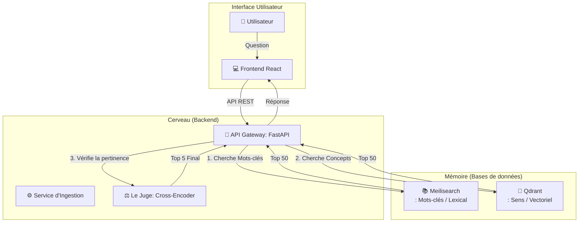
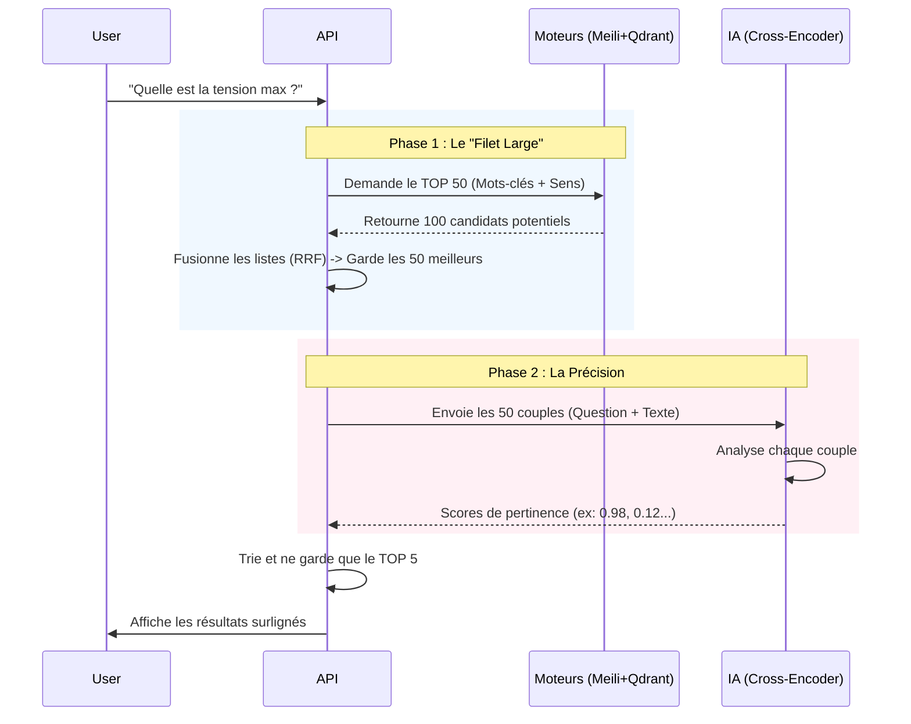

# Documentation Technique & Fonctionnelle : Système de Recherche Hybride (RAG)

Cette documentation détaille le fonctionnement du moteur de recherche documentaire intelligent. Elle est conçue pour être accessible aux néophytes tout en fournissant la précision technique nécessaire aux développeurs.

---

## 1. Introduction : L'Analogie du Bibliothécaire

Pour comprendre ce système, imaginez une équipe de trois personnes chargée de trouver une réponse dans une immense bibliothèque :

1.  **Le Documentaliste Rapide (Meilisearch / BM25) :** Il a un index de tous les mots. Si vous cherchez "Erreur 404", il vous donne instantanément toutes les pages contenant "Erreur" et "404". C'est rapide, mais il ne comprend pas le sens.
2.  **L'Assistant Sémantique (Qdrant / Vecteurs) :** Il a lu tous les livres et comprend les concepts. Si vous demandez "Pourquoi mon appareil ne marche pas ?", il trouvera les pages parlant de "panne", "défaut" ou "problème", même si le mot "marche" n'y est pas.
3.  **Le Juge Expert (Cross-Encoder / Re-ranker) :** Il est plus lent mais très méticuleux. Il prend les 50 documents trouvés par les deux premiers, les lit attentivement un par un en les comparant à votre question, et décide lesquels sont *vraiment* la meilleure réponse.

**Ce système fait exactement cela informatiquement :**
*   **Hybride :** Il combine Mots-clés + Sens.
*   **Reranking :** Il vérifie les résultats pour une précision maximale.

---

## 2. Architecture Technique

Le système repose sur une architecture micro-services conteneurisée via Docker.

---

## 3. Le Fonctionnement en Détail

### Étape 1 : L'Ingestion (La préparation des données)
Avant de pouvoir chercher, le système doit "lire" et "comprendre" les fichiers PDF.

1.  **Extraction :** Le texte est extrait du PDF.
2.  **Chunking (Découpage) :** Le texte est trop long pour être analysé d'un bloc. Il est découpé en morceaux ("chunks") d'environ 150 mots (800 caractères).
    *   *Subtilité technique :* On garde un "overlap" (chevauchement) de 200 caractères entre les morceaux pour ne pas couper une phrase importante au milieu.
3.  **Double Indexation :**
    *   Le texte brut part dans **Meilisearch** pour la recherche par mots-clés.
    *   Le texte est transformé en vecteurs (une liste de 384 nombres) par un modèle IA (`Bi-Encoder`) et stocké dans **Qdrant**.

### Étape 2 : La Recherche (Retrieval)
Quand l'utilisateur pose une question, le système lance deux recherches parallèles :

*   **Recherche Lexicale (BM25) :** Cherche les mots exacts.
    *   *Avantage :* Imbattable pour des références précises (ex: "Article L-123", "Erreur 500").
*   **Recherche Vectorielle (Dense Retrieval) :**
    *   La question est transformée en vecteur mathématique.
    *   On cherche dans Qdrant les vecteurs de documents les plus proches spatialement (Cosinus Similarity).
    *   *Avantage :* Trouve la réponse même si les mots sont différents (Synonymes, périphrases).

### Étape 3 : La Fusion (RRF - Reciprocal Rank Fusion)
L'API reçoit ~50 résultats de Meilisearch et ~50 de Qdrant. Comment les mélanger ?
Ils n'ont pas les mêmes scores (Meili donne des scores entiers, Qdrant des pourcentages).
On utilise le **RRF** qui se base uniquement sur le **classement** :
> "Si un document est 1er chez Meili et 3ème chez Qdrant, c'est probablement un excellent candidat."

### Étape 4 : Le Re-ranking (La vérification)
C'est ici que la magie opère pour obtenir une précision "Enterprise Grade".

Les ~50 meilleurs candidats issus de la fusion passent devant le **Cross-Encoder**.
*   **Bi-Encoder (Utilisé avant) :** Traite la question et le document séparément. Rapide mais manque de nuance.
*   **Cross-Encoder (Le Juge) :** Prend la paire `(Question + Document)` et l'analyse comme un tout. Il peut comprendre les liens logiques complexes.
    *   *Exemple :* Si la question est "Qu'est-ce qui n'est **pas** autorisé ?", le vecteur seul peut confondre avec "Ce qui est autorisé". Le Cross-Encoder verra la négation.

---

## 4. Les Modèles d'IA (Le Cerveau)

Nous avons choisi des modèles spécifiques pour le support du Français.

| Rôle | Modèle Technique | Pourquoi ce choix ? |
|------|------------------|---------------------|
| **Vectorisation** | `paraphrase-multilingual-MiniLM-L12-v2` | C'est un modèle **multilingue**. Contrairement aux modèles standards (L6), celui-ci (L12) est plus "profond" et capte mieux les nuances du français. |
| **Re-ranking** | `cross-encoder/ms-marco-MiniLM-L-6-v2` | Entraîné spécifiquement sur le dataset MS MARCO (Microsoft) pour juger la pertinence d'une réponse. C'est lui qui garantit la qualité finale. |

---

## 5. Flux de Données (Data Flow)

## 6. Glossaire

*   **RAG (Retrieval Augmented Generation) :** Technique consistant à chercher des infos dans ses propres documents (Retrieval) pour répondre (Generation). Ici, nous nous concentrons sur la partie Retrieval (Recherche).
*   **Chunk :** Un morceau de texte. Un PDF de 100 pages est découpé en milliers de petits chunks.
*   **Embedding :** Traduction d'un texte en une liste de nombres (vecteur) compréhensible par l'IA.
*   **BM25 :** Algorithme standard de recherche par mots-clés (évolution du TF-IDF).
*   **Inférence :** Le moment où l'IA "réfléchit" pour calculer un vecteur ou un score.