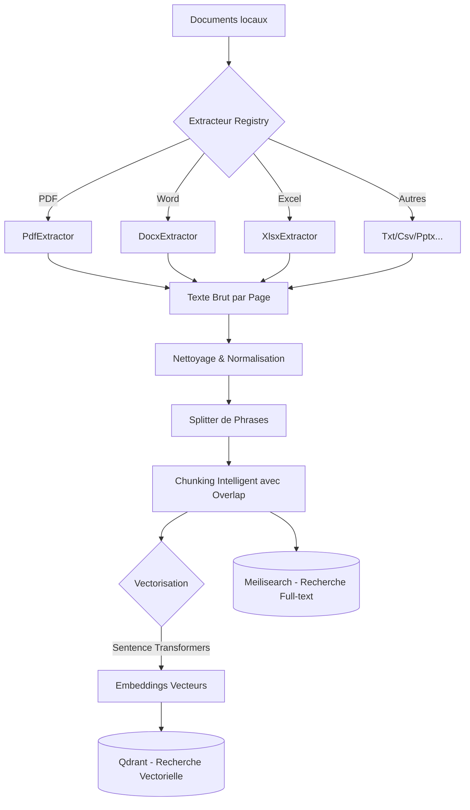

# 🚀 Pipeline d'Ingestion Sémantique

Ce module Python est responsable de la transformation de documents bruts (PDF, Word, Excel, etc.) en vecteurs de données exploitables pour la recherche sémantique.

## 🏗️ Architecture Technique



## ✨ Fonctionnalités Clés

- **Extraction Multi-format** : Support natif du `.pdf`, `.docx`, `.pptx`, `.xlsx`, `.csv` et `.txt`.
- **Chunking Sémantique** : Découpage intelligent qui respecte la structure des phrases pour ne pas perdre le sens.
- **Hybrid Search** : Alimente simultanément une base vectorielle (Qdrant) et textuelle (Meilisearch).
- **Performance** : Utilise `uv` pour une gestion ultra-rapide des dépendances et de l'exécution.
- **Qualité** : Couverture de tests de **100%** sur toute la logique métier.

## 🛠️ Installation & Usage

### Pré-requis
- [uv](https://github.com/astral-sh/uv) installé sur votre machine.
- Instances Qdrant et Meilisearch accessibles (via Docker Compose).

### Installation
```powershell
uv sync
```

### Lancer l'ingestion
Le script va scanner le dossier défini dans votre `.env` (par défaut `./data/docs`) et indexer tout le contenu :
```powershell
uv run ingest
```

## 🧪 Tests & Qualité

Nous maintenons une rigueur maximale sur le traitement du texte :
```powershell
# Lancer les tests
uv run pytest

# Générer le rapport de couverture détaillé
uv run pytest --cov=ingest --cov-report=html
```

## 📁 Structure du Projet

- `src/ingest/extractors/` : Logique spécifique à chaque format de fichier.
- `src/ingest/text_utils.py` : Algorithmes de découpage et de nettoyage.
- `src/ingest/main.py` : Orchestrateur de la pipeline.
- `tests/` : Suite complète de tests unitaires.
